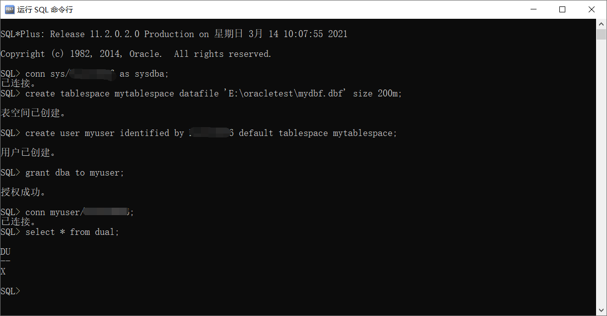
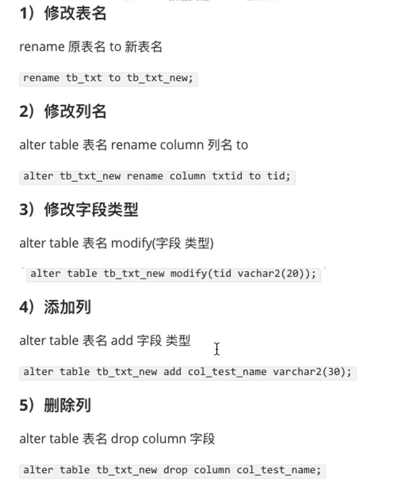

## Oracle学习笔记

[TOC]

### 基础

#### 安装 Oracle 数据库

- 版本：11g r2 Experss Edition 精简版
- 下载网址：<https://www.oracle.com/database/technologies/xe-prior-releases.html>
- 解压并运行 ***exe*** 安装
- 开始->运行SQL

```sql
conn sys as sysdba
-- 密码为安装时输入的
select 1 from dual;
exit;
```

#### 创建用户和表空间

```sql
sqlplus /nolog;  -- 启动sqlplus不登陆
conn sys/密码 as sysdba; -- 通过超级管理员以dba的身份连接
create tablespace 表空间名 datafile '文件路径\\文件名.dbf' size 空间大小; -- 创建表空间
create user 用户名 identified by 密码 default tablespace 表空间; -- 创建用户并指定表空间
grant dba to 用户; -- 给用户授予dba权限，dba 最大权限
```



#### 约束

> 1. 主键约束 （PRIMARY KEY）
> 2. 唯一约束 （UNIQUE）
> 3. 非空约束 （NOT NULL）
> 4. 外键约束 （FOREIGN KEY）
> 5. 检查约束 （CHECK）

##### 主键

- Oracle 中的表可以没有主键
- 相当于 UNIQUE + NOT NULL 约束
- 一个表只能有一个主键
- 主键所在列必须具有索引（主键唯一约束通过索引实现），如果不存在，将会在索引添加的时候自动创建

#### PLSQL 安装

> 官网下载（包括PLSQL及其中文语言包）：<https://www.allroundautomations.com/registered-plsqldev/>
>
> 产品号：4vkjwhfeh3ufnqnmpr9brvcuyujrx3n3le
>
> 序列号：226959
>
> 口令：xs374ca

#### SQL语言介绍

> SQL (Structured Query Language)
>
> 1. DDL (Data Definition Languages)：数据定义语句，create、drop、alter等；
>
> 2. DML (Data Mainpulation Language)：数据操纵语句，insert、delete、select、update等；
>
> 3. DCL (Data Control Language)：数据控制语句，grant、revoke等。

#### 别名

- 列别名

```sql
SELECT DEPTNO 别名 FROM EMP;
SELECT DISTINCT DEPTNO AS 别名 FROM EMP;
```

- 表别名

#### 伪列和虚表

##### 伪列和表达式

说明：查询不存在的列即为伪列，当需要的结果不能直接从表中得到，而是需要计算来展示，则可是使用伪列+表达式实现。

```sql
select 1 from dual;
```

##### 虚表

- ***dual***

```sql
SELECT 999*666 FROM DUAL;
```


### 字符相关

#### 引号

使用两个单引号转义

```sql
''
```

#### 字符串拼接

```sql
SELECT (ENAME || '-' || JOB) name_job FROM EMP;
```


### 字段类型相关

### 关键字相关

#### 空值

```sql
IS NULL
IS NOT NULL
```

### 函数

#### 常用单行函数

##### 字符函数

```sql
concat(x, y)  -- 连接x, y字符串
instr(x, str, start, n)          -- 在x中查找str，可以指定从start开始，也可以查找出现第n次的字符，返回的是索引，从1开始
length(x)    -- 返回x的长度
lower(x)    -- 转换为小写
upper(x)      -- 大写
ltrim(x, trim_str)   -- 把x左边截去trim_str，缺省trim_str截去左边空格
rtrim(x, trim_str)    -- 把x右边截去trim_str，缺省trim_str截去右边空格
trim(x)              -- 去除两边空格
replace(x, old, new ) -- 在x中查找old，并替换为new
substr(x, start, length)    -- 截取字符，start为0或1都表示从第一个字符开始,截取长度为length
wm_concat(列)  -- 将列值以 ',' 分隔起来，并显示成一行
```

- 测试

```sql
SELECT CONCAT('hello', 'world') FROM DUAL;
SELECT INSTR('helloworld', 'l', 3, 3) FROM DUAL; -- 9
SELECT ENAME, LENGTH(ENAME) lengthname FROM EMP;

SELECT LTRIM('helloworld', 'hello') FROM DUAL; -- world
SELECT RTRIM('aaa12345abc', 'abc') FROM DUAL; -- aaa12345

SELECT TRIM('    xxx   ') FROM DUAL;

SELECT REPLACE('zxcvbnabcki', 'abc', 'jjj') FROM DUAL; -- zxcvbnjjjki

SELECT SUBSTR('123456789',1 , 5) FROM DUAL; -- 12345
```

##### 字符拼接以0开头小数，0消失

- to_char()

- 小数前的数字代表最大位数
- 个位为0表示：小数为 0.几的时候，保留 0
- 小数点后为保留小数位数

```sql
to_char(值,'fm9999990.00')
```


##### 数学函数

```sql
abs(x)        x的绝对值

ceil(x)         向上取整

floor(x)       向下取整

mod(x, y)     取模
```

##### 日期函数

```sql
sysdate           当前系统时间
current_date      返回当前系统日期
add_months(d1, n1) 返回在日期d1基础上再加上 n1 个月后的新日期
last_day(d1)       返回日期d1所在月份的最后一天的日期
months_between(d1, d2)    返回日期d1到日期d2之间的月数，d1-d2
next_day(d1, [c1])        返回日期d1，在下周星期几(参数c1)的日期，参数c1若为数字1-7，表示星期天->星期六
```

- 测试

```sql
SELECT SYSDATE FROM DUAL; -- 2021-03-16 19:27:40
SELECT CURRENT_DATE FROM DUAL; -- 2021-03-16 19:28:11
-- 加天数
SELECT SYSDATE + 20 FROM DUAL; -- 2021-04-05 19:30:57
-- 加月数
SELECT ADD_MONTHS(TO_DATE('2021-03-16', 'yyyy-MM-dd'), 5) FROM DUAL; -- 2021-08-16 00:00:00
SELECT LAST_DAY(SYSDATE) FROM DUAL; -- 2021-03-31 19:34:54
-- -6.48973902329749103942652329749103942652
SELECT MONTHS_BETWEEN(SYSDATE, TO_DATE('2021-10-01', 'yyyy-MM-dd')) FROM DUAL;

SELECT NEXT_DAY(SYSDATE, '星期二') FROM DUAL; -- 2021-03-23 19:39:27
```

##### 日期截取函数

- trunc()

```sql
-- 2021-03-22 00:00:00
SELECT TRUNC(SYSDATE) FROM dual;
-- 2021-01-01 00:00:00
SELECT TRUNC(SYSDATE, 'yy') FROM dual;
-- 2021-03-01 00:00:00
SELECT TRUNC(SYSDATE, 'mm') FROM dual;
-- 2021-03-22 00:00:00
SELECT TRUNC(SYSDATE, 'dd') FROM dual;
-- 2021-03-22 11:00:00
SELECT TRUNC(SYSDATE, 'hh') FROM dual;
-- 2021-03-22 11:48:00
SELECT TRUNC(SYSDATE, 'mi') FROM dual;

-- 没有 秒 的截取
```

##### 转换函数

```sql
to_char(x, c)     将日期或数据x，按照c的格式转换为char数据类型
to_date(x, c)     
to_number(x)
```

- 测试

```sql
SELECT ENAME, HIREDATE, TO_CHAR(HIREDATE, 'yyyy/MM/dd hh24:mi:ss') FROM EMP;
SELECT ENAME, HIREDATE, TO_CHAR(HIREDATE, 'yyyy "年" MM "月" dd "日" hh24:mi:ss') FROM EMP;

SELECT TO_DATE('2020/11/11 12:12:12', 'yyyy-mm-dd hh24:mi:ss') FROM DUAL;
-- 当前时间 精确到5位毫秒 16-3月 -2021 19:58:55.36000
select to_char(current_timestamp(5), 'DD-MON-YYYY HH24:MI:SSxFF') from dual; 
```

#### 组函数

组函数同时对多条记录进行操作，并返回一个结果

> avg()
>
> sum()
>
> min()
>
> max()
>
> count()
>
> **注意：null 不参与运算**

```sql
-- 统计记录数
SELECT COUNT(*) FROM EMP;

-- 去重统计(不会统计重复DEPTNO)
SELECT COUNT(DISTINCT DEPTNO) FROM EMP;

-- 处理null值后再统计
SELECT COUNT(NVL(COMM, 0)) FROM EMP;
```

#### 分组

- select ... from ... where ... group by
- 执行顺序：from -> where -> group by -> having -> select

```sql
-- 每个部门的平均工资
SELECT DEPTNO, AVG(SAL) FROM EMP GROUP BY DEPTNO;

-- 查询相同工种的平均工资以及相同工种的人数
SELECT JOB, AVG(SAL), count(*) FROM EMP GROUP BY JOB;
```

- having 对组信息过滤

```sql
-- 获取平均工资大于2000的部门信息
SELECT DEPTNO, AVG(SAL) FROM EMP GROUP BY DEPTNO HAVING AVG(SAL) > 2000; 
-- 执行顺序 from -> group by -> having -> select

-- 查询部门人数大于3的部门
SELECT DEPTNO, COUNT(*) FROM EMP GROUP BY DEPTNO HAVING COUNT(*) > 3;
```

- where 对行信息进行过滤

```sql
-- 查询工资大于2000并且所在部门人数大于2的员工
SELECT DEPTNO, COUNT(*) FROM EMP WHERE SAL > 1000 GROUP BY DEPTNO HAVING COUNT(*) >= 2;
```

#### null 处理 nvl()

##### nvl()

- nvl(exp1, exp2)
- exp1：表达式
- exp2：exp1为 null 时，替换为 参数2的值

```sql
SELECT ENAME, SAL, COMM, (SAL+NVL(COMM, 0)) income FROM EMP;
```

##### 排序时 null 处理

- `nulls first`    空值排前面
- `nulls last `       空值排后面

```sql
-- 先用COMM降序，NULL值放后面；再用income升序
SELECT ENAME, SAL, COMM, (SAL+NVL(COMM, 0)) income FROM EMP ORDER BY COMM DESC NULLS LAST, income ASC;
```

### 分页与去重

#### 分页介绍

- (假分页) 一次性查出所有记录，只返回部分记录；
- (真分页)只查分页的记录。

> 分页的核心是计算每页有多少记录、总页数、第几页；每一页的数据则只需要起始记录和结束记录。

##### rownum

- 伪字段，记录结果集每一条记录的序号，从1开始
- 注意1：不能使用 rownum > 数字 作为条件，因为结果集中第一条记录永远是 1 ，rownum > 正数 无结果，rownum >= 1 返回所有记录
- 要实现只返回 某个区间的记录，可以先查 rownum 作为一列的结果作为子查询。（注意给 rownum 取别名）

```sql
-- 返回前5条记录
SELECT ENAME, SAL, rownum FROM EMP WHERE rownum <= 5
-- 无记录
SELECT ENAME, SAL, rownum FROM EMP WHERE rownum > 1
-- 查询 5-10条记录
SELECT * FROM (SELECT ENAME, SAL, ROWNUM AS xh FROM EMP WHERE ROWNUM <= 10) r1 WHERE xh BETWEEN 5 AND 10
```

##### oracle 分页实现

- 注意2：对排序的分页时，需要先将排序结果作为子查询，再查 rownum 命别名，再用别名计算分页；（因为 order by 执行顺序在最后）

```sql
-- 查询员工信息，工资降序，分页，每页3条记录
-- 第1页
SELECT r2.* FROM (SELECT r1.*,rownum xh FROM (SELECT ENAME, SAL, DEPTNO FROM EMP ORDER BY SAL DESC) r1) r2 WHERE r2.xh>0 AND r2.xh<=3;
-- 第2页
SELECT r2.* FROM (SELECT r1.*,rownum xh FROM (SELECT ENAME, SAL, DEPTNO FROM EMP ORDER BY SAL DESC) r1) r2 WHERE r2.xh>3 AND r2.xh<=6;
```

#### 去除重复记录

##### rowid 介绍

- 根据每一行数据物理地址信息编码成一个伪列
- 只对某个字段进行去重，distinct 与 group by 会对要查询的字段一起进行去重，这时使用 rowid 去重。


##### 重复记录的查找

```sql
SELECT c.*, rowid FROM copy c ORDER BY deptno;
```


- 删除重复记录，只保留 rowid 最小的记录

````sql
-- 删除重复记录，只保留 rowid 最小的记录
DELETE FROM COPY WHERE ROWID NOT IN (SELECT MIN(rowid) FROM COPY GROUP BY DEPTNO, DNAME, LOC);
````

- 按某个字段去重

```sql
-- 按 DEPTNO 字段去重，保留 rowid 最大的
SELECT * FROM COPY WHERE ROWID IN (SELECT MAX(ROWID) FROM COPY GROUP BY DEPTNO);
```

### 表连接

#### 表连接介绍

- 连接多张表，特别是具有外键关系的表

- 92标准
- 99标准

#### SQL 92 语法

- 结构 `select ... from t1,t2,t3... where ...`
- 很多时候需要给表取别名，可能存在自连接的情况
- 原理是先做笛卡尔连接，再用 where 条件筛选

##### 笛卡尔积

- 两个集合里面的每一个成员，都与对方集合中的任意一个成员有关联。
- 结果数量为两张表的乘积

```sql
SELECT * FROM EMP e, DEPT d;
```

##### SQL 92 等值连接

```sql
SELECT * FROM EMP e, DEPT d WHERE e.DEPTNO=d.DEPTNO ORDER BY EMPNO;
-- 查询出所有部门的员工数量及其部门信息
SELECT * FROM DEPT d, (SELECT COUNT(*), DEPTNO FROM EMP GROUP BY DEPTNO) e WHERE d.DEPTNO = e.DEPTNO;
```

##### SQL 92 非等值连接

- `!= 、> 、 < 、 <> 、 between and`

```sql
-- 查询员工姓名，工资及其等级
SELECT ENAME,SAL,GRADE FROM EMP e, SALGRADE s WHERE e.SAL BETWEEN s.LOSAL AND s.HISAL;
```

##### SQL 92 外连接

###### 内联接

- 查询部门信息及其人数（简单内连接，根据条件连接，不满足条件的会被舍去

```sql
-- 查询部门信息及其人数（简单内连接，根据条件连接，不满足条件的会被舍去）
SELECT * FROM DEPT d, (SELECT DEPTNO, COUNT(*) FROM EMP GROUP BY DEPTNO) r WHERE d.DEPTNO = r.DEPTNO
```

| DEPTNO |   DNAME    |   LOC    | DEPTNO | COUNT(*) |
| :----: | :--------: | :------: | :----: | :------: |
|   10   | ACCOUNTING | NEW YORK |   10   |    3     |
|   20   |  RESEARCH  |  DALLAS  |   20   |    3     |
|   30   |   SALES    | CHICAGO  |   30   |    6     |

###### 外联接

- 条件后面加上 (+) 表示**从表**，没有(+)的是主表，主表的所有记录都会存在，不满足条件的字段为 NULL
- 92 标准 不用区分 左外联接 和 右外联接；只需知道 (+) 标识从表。

```sql
-- 外联接 查询部门信息及其人数 为NULL字段设为0
SELECT d.DEPTNO, DNAME, LOC, NVL(r.c, 0)  FROM DEPT d, (SELECT DEPTNO, COUNT(*) c FROM EMP GROUP BY DEPTNO) r WHERE d.DEPTNO = r.DEPTNO(+)
```

| DEPTNO | DNAME      | LOC      | NVL(R.C,0) |
| ------ | ---------- | -------- | ---------- |
| 10     | ACCOUNTING | NEW YORK | 3          |
| 20     | RESEARCH   | DALLAS   | 3          |
| 30     | SALES      | CHICAGO  | 6          |
| 40     | OPERATIONS | BOSTON   | 0          |

##### SQL 92 自连接

- 特殊的等值连接，来自于同一张表

```sql
-- 查询出每个有上级的员工自己的信息及其上级的信息
SELECT e1.ENAME, e1.EMPNO, e2.ENAME MGRNAME, e2.EMPNO MGRNO FROM EMP e1, EMP e2 WHERE e1.EMPNO = e2.MGR
```

#### SQL 99 语法

##### cross join

- 交叉连接，实现笛卡尔积
- 结果数量为 A*B

```sql
SELECT * FROM EMP CROSS JOIN DEPT;
```

##### natural join

- 自然连接，做等值连接
- 需要有（同名列、主外键）

- 自动根据同名列或主外键等值连接

```sql
-- 查询员工信息及其部门信息
SELECT ENAME,DEPTNO,DNAME,LOC FROM EMP NATURAL JOIN DEPT;
```

##### join using

- using 连接，等值连接
- 必须有同名列

```sql
-- 查询员工信息及其部门信息
SELECT ENAME,DEPTNO,DNAME,LOC FROM EMP JOIN DEPT USING(DEPTNO);

-- 查询员工信息及其部门信息为10的
SELECT ENAME,DEPTNO,DNAME,LOC FROM EMP JOIN DEPT USING(DEPTNO) WHERE DEPTNO=10;

SELECT ENAME,DEPTNO,DNAME,LOC FROM EMP NATURAL JOIN DEPT WHERE DEPTNO=10;
```

##### join on

- on 连接，可做等值连接、非等值连接、自连接，可以解决一切连接，关系列必须要区分

```sql
-- 查询员工信息及其部门信息
SELECT ENAME,e.DEPTNO,DNAME,LOC FROM EMP e JOIN DEPT d ON e.DEPTNO=d.DEPTNO;
-- 查询员工信息及其工资等级
SELECT e.ENAME,e.SAL,s.GRADE FROM EMP e JOIN SALGRADE s ON e.SAL BETWEEN s.LOSAL AND s.HISAL
```

##### outer join

- 外连接 有主从之分

- left join on 左外连接
- left join using  左外连接（只能等值连接）
- right join on 右外连接
- right join on 右外连接（只能等值连接）

```sql
-- 查看所有部门及其员工数量
SELECT * FROM DEPT d LEFT JOIN (SELECT DEPTNO,COUNT(*) FROM EMP GROUP BY DEPTNO) r ON d.DEPTNO = r.DEPTNO 

-- 查询员工信息及其上级信息
SELECT e.EMPNO,e.ENAME,m.MGR,m.ENAME MGRNAME FROM EMP e LEFT JOIN EMP m ON e.EMPNO=m.EMPNO
```

##### 全连接

```sql
-- 查询所有员工及其部门信息，40部门无员工也会显示
SELECT * FROM EMP e FULL JOIN DEPT d ON e.DEPTNO=d.DEPTNO
```

### 集合操作

> Union：并集(去重)，不包括重复行同时进行默认规则排序
>
> Union All：全集，不去重，不排序
>
> Intersect：交集，去重，不包括重复行，默认排序
>
> Minus：差集，减去重复行，默认排序

```sql
(SELECT 'a','b' FROM DUAL
UNION 
SELECT 'c','d' FROM DUAL
UNION ALL
SELECT 'c','d' FROM DUAL)
INTERSECT 
(SELECT 'a','b' FROM DUAL
UNION 
SELECT 'c','d' FROM DUAL
UNION ALL
SELECT 'c','d' FROM DUAL)
MINUS
SELECT 'a','b' FROM DUAL
```

### DDL 相关

#### 介绍

- DDL：Data Definition Language，定义不同的数据段、数据库、表、列、索引
- create、drop、alter

#### 表操作

##### 创建表

- 创建新表

```sql
create table 表名(
	字段名 类型(长度),
    ...其他字段...
);
```

- 从其他表拷贝结构

```sql
create table 表名 as select 字段列表 from 已有表 where 1!=1
```

###### Oracle 数据类型

| 类型                         | 描述                                                         |
| ---------------------------- | ------------------------------------------------------------ |
| CHAR()                       | CHAR 类型，定长字符串，会用空格填充来达到其最大长度。非 NULL 的 CHAR(12) 总是包含 12 字节信息。CHAR 字段最多可以存储 2,000 字节的信息。如果创建表时，不指定 CHAR 长度，则默认为 1。 |
| VARCHAR2()                   | 变长字符串，与 CHAR 类型不同，它不会使用空格填充至最大长度。VARCHAR2 最多可以存储 4,000 字节的信息。 |
| NVARCHAR2()                  | 这是一个包含 UNICODE 格式数据的变长字符串。 NVARCHAR2 最多可以存储 4,000字节的信息。 |
| NUMBER(P,S)                  | P 是 Precision 的英文缩写，即精度缩写，表示有效数字的位数，最多不能超过 38 个有效数字。<br/>S 是 Scale 的英文缩写，表示小数点数字的位数。 |
| INTEGER                      | INTEGER 是 NUMBER 的子类型，它等同于 NUMBER（38,0），用来存储整数。若插入、更新的数值有小数，则会被四舍五入。 |
| BINARY_FLOAT                 | BINARY_FLOAT 是 32 位、 单精度浮点数字数据类型。可以支持至少 6 位精度,每个BINARY_FLOAT 的值需要 5 个字节，包括长度字节 |
| BINARY_DOUBLE                | BINARY_DOUBLE 是为 64 位，双精度浮点数字数据类型。每个 BINARY_DOUBLE的值需要 9 个字节，包括长度字节。 |
| DATE                         | DATE 是最常用的数据类型，日期数据类型存储日期和时间信息。虽然可以用字符或数字类型表示日期和时间信息，但是日期数据类型具有特殊关联的属性。为每个日期值，Oracle存储以下信息： 世纪、 年、 月、 日期、 小时、 分钟和秒。一般占用 7 个字节的存储空间。 |
| TIMESTAMP                    | 这是一个 7 字节或 12 字节的定宽日期/时间数据类型。它与 DATE 数据类型不同，因为TIMESTAMP 可以包含小数秒，带小数秒的 TIMESTAMP 在小数点右边最多可以保留 9 位。 |
| TIMESTAMPWITH TIME ZONE      | 这是 TIMESTAMP 类型的变种，它包含了时区偏移量的值。          |
| TIMESTAMPWITH LOCALTIME ZONE | 将时间数据以数据库时区进行规范化后进行存储                   |
| CLOB                         | Character Large Object 二进制数据，存储单字节和多字节字符数据。最大长度 4G |
| BLOB                         | Binary Large Object 它存储非结构化的二进制数据大对象，它可以被认为是没有字符集语义的比特流，一般是图像、声音、视频等文件。最大长度 4G。 |
| NCLOB                        | 存储 UNICODE 类型的数据 ，最大长度 4G。                      |
| LONG                         | 存储变长字符串，最多达 2G字节                                |
| RAW                          | 用于存储二进制或字符类型数据，必须制定长度。这种数据类型存储的数据不会发生字符集转换。可存放多媒体图象声音等。 |
| LONG RAW                     | 能存储 2GB 的原始二进制数据，可存放多媒体图象声音等          |

##### 添加主键

DBeaver 中：

给**表**添加 **约束**

| 约束字段 |  名称  | 所有者 |    类型     | 条件 |
| :------: | :----: | :----: | :---------: | :--: |
| 对应字段 | 自定义 |  表名  | PRIMARY KEY | 不填 |

##### 设置自增

1. 添加序列

| 序列名称 |           值            | 最小值 |       最大值        | 步长 |
| :------: | :---------------------: | :----: | :-----------------: | :--: |
|  自定义  | 1（自动表中自增最大值） |   1    | 9999999999999999999 |  1   |

2. 给表添加触发器
   - 代码方式

```sql
CREATE OR REPLACE
TRIGGER 触发器名称 BEFORE
INSERT
	ON
	添加触发器的表 FOR EACH ROW
	WHEN(NEW.ID IS NULL)
BEGIN
		SELECT
	前面新建的序列名称.Nextval
INTO
	:NEW.ID
FROM
	dual;
END;
```

- DBeaver 手动方式

|    字段    |                             内容                             |
| :--------: | :----------------------------------------------------------: |
|    名称    |                            自定义                            |
|     表     |                             表名                             |
|  对象类型  |                            TABLE                             |
| 触发器类型 |                       BEFORE EACH ROW                        |
|    事件    |                            INSERT                            |
|    字段    |                          （无）不填                          |
|  参照名称  |              REFERENCING NEW AS NEW OLD AS OLD               |
| When 子句  |                        NEW.ID is NULL                        |
|    状态    |                           ENABLED                            |
|    描述    | 触发器名称   <br/>BEFORE INSERT ON 表名    <br/>	for each row |
|  动作类型  |                            PL/SQL                            |

##### 修改表结构



#### 约束

1. 主键约束 （PRIMARY KEY）
2. 唯一约束 （UNIQUE）
3. 非空约束 （NOT NULL）
4. 外键约束 （FOREIGN KEY）
5. 检查约束 （CHECK）

##### 创建表和约束

###### 表名：tb_user

| 编号 | 字段名   | 字段类型     | 说明                           |
| ---- | -------- | ------------ | ------------------------------ |
| 1    | userid   | number(5)    | 用户id，主键                   |
| 2    | username | varchar2(30) | 用户名，非空，4~20字节         |
| 3    | userpwd  | varchar2(20) | 密码，非空，4~18字节           |
| 4    | age      | number(3)    | 年龄，默认18，值大于等于18     |
| 5    | gender   | char(3)      | 性别，默认‘男’，只能‘男’  ‘女’ |
| 6    | email    | varchar2(30) | 邮箱，唯一                     |
| 7    | regtime  | date         | 注册时间 默认当前时间          |

###### 表名：tb_txt 文章表

| 编号 | 字段名  | 字段类型       | 说明                                                        |
| ---- | ------- | -------------- | ----------------------------------------------------------- |
| 1    | txtid   | number(5)      | 文章编号，主键                                              |
| 2    | title   | varchar2(32)   | 文章标题，非空                                              |
| 3    | txt     | varchar2(1024) | 内容，最大长度1024                                          |
| 4    | pubtime | date           | 发布日期，默认当前日期                                      |
| 5    | userid  | number(5)      | 作者，外键，参考用户表用户id，当用户表中删除时，自设为 null |

###### 创建表，默认约束名

```sql
CREATE TABLE tb_user(
	userid number(5) PRIMARY KEY,
	username varchar2(30) NOT NULL check(LENGTH(username) BETWEEN 4 AND 20),
	userpwd varchar2(20) CHECK(LENGTH(userpwd) BETWEEN 4 AND 18) NOT NULL,
	age number(3) DEFAULT(18) CHECK(age>=18),
	gender char(3) DEFAULT('男') CHECK(gender IN ('男','女')),
	email varchar2(30) UNIQUE,
	regtime DATE DEFAULT(sysdate)
);

CREATE TABLE tb_txt(
	txtid number(5) PRIMARY KEY,
	title varchar2(32) NOT NULL,
	txt varchar2(1024),
	pubtime DATE DEFAULT(sysdate),
	userid number(5) REFERENCES tb_user(userid) ON DELETE SET NULL
);
```

###### 创建表，设定约束名

```sql
CREATE TABLE tb_user(
	userid number(5),
	username varchar2(30) CONSTRAINT nn_user_name NOT NULL,
	userpwd varchar2(20) CONSTRAINT nn_user_pwd NOT NULL,
	age number(3) DEFAULT(18),
	gender char(3) DEFAULT('男'),
	email varchar2(30),
	regtime DATE DEFAULT(sysdate),
	CONSTRAINT pk_user_id PRIMARY KEY(userid),
	CONSTRAINT ck_user_name check(LENGTH(username) BETWEEN 4 AND 20),
	CONSTRAINT ck_user_pwd CHECK(LENGTH(userpwd) BETWEEN 4 AND 18),
	CONSTRAINT ck_age CHECK(age>=18),
	CONSTRAINT ck_gender CHECK(gender IN ('男','女')),
	CONSTRAINT uni_email UNIQUE(email)
);


CREATE TABLE tb_txt(
	txtid number(5),
	title varchar2(32) CONSTRAINT nn_title NOT NULL,
	txt varchar2(1024),
	pubtime DATE DEFAULT(sysdate),
	userid number(5),
	CONSTRAINT pk_txt_id PRIMARY KEY(txtid),
	CONSTRAINT fk_user_id FOREIGN KEY(userid) REFERENCES tb_user(userid) ON DELETE SET NULL 
);
```

###### 创建并追加约束

 ```sql
CREATE TABLE tb_user(
	userid number(5),
	username varchar2(30),
	userpwd varchar2(20),
	age number(3),
	gender char(3),
	email varchar2(30),
	regtime DATE
);
-- 追加约束
ALTER TABLE tb_user ADD CONSTRAINT pk_user_id PRIMARY KEY (userid);
ALTER TABLE tb_user ADD CONSTRAINT ck_user_name check(LENGTH(username) BETWEEN 4 AND 20); 
ALTER TABLE tb_user ADD CONSTRAINT ck_user_pwd CHECK(LENGTH(userpwd) BETWEEN 4 AND 18);
ALTER TABLE tb_user ADD CONSTRAINT ck_age CHECK(age>=18);
ALTER TABLE tb_user ADD CONSTRAINT ck_gender CHECK(gender IN ('男','女'));
ALTER TABLE tb_user ADD CONSTRAINT uq_email UNIQUE(email);
-- 非空与默认
ALTER TABLE tb_user MODIFY (username CONSTRAINT nn_user_name NOT NULL);
ALTER TABLE tb_user MODIFY (userpwd CONSTRAINT nn_user_pwd NOT NULL);
ALTER TABLE tb_user MODIFY (age DEFAULT(18));
ALTER TABLE tb_user MODIFY (gender DEFAULT ('男'));
 ```

###### 外键三种方式

```sql
ALTER TABLE tb_txt ADD CONSTRAINT fk_txt_user_id FOREIGN KEY (userid) REFERENCES tb_user(userid); -- 强制不让删
ALTER TABLE tb_txt ADD CONSTRAINT fk_txt_user_id FOREIGN KEY (userid) REFERENCES tb_user(userid) ON DELETE SET NULL; -- 自动设为空
ALTER TABLE tb_txt ADD CONSTRAINT fk_txt_user_id FOREIGN KEY (userid) REFERENCES tb_user(userid) ON DELETE CASCADE; -- 级联删除
```

##### 禁用和启用约束

###### 约束的两类状态

1. 启用/禁用 (`enable/disable`): 是对**新添加**数据的约束。
2. 验证/非验证 (`validate/novalidate`): 添加约束时，表中已有数据，是否对已有数据进行校验。

###### 约束状态的4种情况

1. enable validate：默认
2. enable novalidate
3. disable validate
4. disable novalidate

##### 删除约束

```sql
ALTER TABLE TB_USER DROP CONSTRAINT ck_user_name;
-- 
ALTER TABLE 表名 DROP CONSTRAINT 约束名;
```


### 查询相关

#### 去重

```sql
select distinct 列名 from 表
```

#### 排序

```sql
-- order by 字句在 select 之后执行
SELECT DEPTNO 别名 FROM EMP ORDER BY 别名 DESC; -- 降序

SELECT DEPTNO 别名 FROM EMP ORDER BY 别名 ASC; -- 升序

SELECT DEPTNO 别名 FROM EMP ORDER BY 别名; -- 默认升序
```

##### 多个字段排序

```sql
SELECT ENAME, SAL, DEPTNO FROM EMP ORDER BY DEPTNO ASC, SAL DESC;
```

#### 查询存在一个表而不在另一个表中的数据记录

[参考](https://blog.csdn.net/weixin_42342702/article/details/92842741)

```sql
1 select A.ID from A left join B on A.ID=B.ID where B.ID is null
```

#### 条件查询

```sql
select 查询内容 from 数据来源 where 条件
```

##### 条件运算

`=、>、<、<=、>=、<>、!=、between and、in、not`

```sql
-- between ... and ... 是 闭区间 []
SELECT ENAME, SAL FROM EMP WHERE SAL BETWEEN 2500 AND 5000 ORDER BY SAL;
-- in里面满足任意一个值就返回
SELECT ENAME, DEPTNO FROM EMP WHERE DEPTNO IN (10, 30);
-- not 取反
SELECT ENAME, DEPTNO FROM EMP WHERE NOT DEPTNO=20;

-- 对空值处理后条件查询
SELECT * FROM EMP WHERE nvl(COMM, 0) <= 0;
```

#### 模糊查询

`_`   `%`  

```sql
-- ENAME 第二个字母为A
SELECT * FROM EMP WHERE ENAME LIKE '_A%';
```

#### 特殊字符处理

- ESCAPE(‘a’)        a只是一个标识，可以为任意字符，其后面第一个字符会被转义

```sql
--- 查询包含%的
SELECT * FROM EMP WHERE ENAME LIKE '%a%%' ESCAPE('a');
-- 查询 包含 'b%'，以 b 作为标识
SELECT * FROM EMP WHERE ENAME LIKE '%bbb%%' ESCAPE('b');
-- 查询既有 % %后又有 _ 的
SELECT * FROM EMP WHERE ENAME LIKE '%c%%c_%' ESCAPE('c');
```

#### where 子句

```sql
SELECT * FROM EMP WHERE DEPTNO=(SELECT DEPTNO FROM DEPT WHERE DNAME = 'ACCOUNTING');

－－　查询工资在等级３的员工信息
SELECT * FROM EMP WHERE SAL BETWEEN (SELECT LOSAL FROM SALGRADE WHERE GRADE = 3) AND (SELECT HISAL FROM SALGRADE WHERE GRADE = 3) 
```

### 插入相关

#### 基础

```sql
insert into 表名(字段1, 字段2, ...) values(值1, 值2, ...)
```

#### 将查询结果插入另一表中

表1和表2有相同 ***字段1***

```sql
-- 表1(字段1) 后的 语句无括号
INSERT INTO 表1(字段1) SELECT 字段1 FROM (SELECT DISTINCT 字段1 FROM 表2 ORDER BY 字段1 DESC);
-- 从其他表拷贝 注意 value 无 s
INSERT INTO 表1(字段) value(select 字段 from 表2)
```

### 更新相关

- 注意：***where*** ，**无条件更新全表**

```sql
update 表 set col1=值1,col2=值2,... where 条件

update 表 set (col1,col2) = (select 值1,值2 from dual) where 条件
```


### 删除相关

- 注意：***where*** ，**无条件删全表**

```sql
-- 删除所有数据
delete 表;
delete from 表 where 条件
```

#### 删除主表（外键被参考的表）记录

建立外键时 三种情况：

1. 默认外键方式，强制不让删
2. on delete set null 从表相关记录设为 null
3. on delete cascade 从表相关记录一起删除

### 高级

#### 循环语句

```sql
-- loop
DECLARE 
	i int := 1;
BEGIN 
	LOOP
		INSERT INTO TEMP(id) values(i);
		EXIT WHEN i=12;
		i := i + 1;
	END LOOP;		
END;

-- while
DECLARE 
	i int := 1;
BEGIN 
	WHILE i < 12 LOOP
		INSERT INTO TEMP(id) values(i);
		i := i + 1;
	END LOOP;
END;

-- for
-- 循环变量为隐式定义，不需要显示声明，并且默认步长为1，添加 revserse 表示从高到低
BEGIN 
	FOR i IN reverse 1..12 LOOP
		INSERT INTO TEMP(id) values(i);
	END LOOP;
END;
```


#### 存储过程

> 教程： <https://zhuanlan.zhihu.com/p/137643958>
>
> 常用结构：<https://zhuanlan.zhihu.com/p/54890263>

注意点：

1. call 调用时，过程后的 ()

   

- 创建

```sql
create or replace procedure PROC_ZS_YJSE_RKRQ as
begin
  INSERT INTO ZS_YJSE_RKRQ(RKRQ) SELECT DISTINCT RKRQ FROM ZS_YJSF_STATISTICS1 s WHERE s.RKRQ NOT IN (SELECT RKRQ FROM ZS_YJSE_RKRQ) ORDER BY RKRQ DESC;
  commit;
end;
```

- 调用

```sql
call PROC_NAME(参数)
```

- 例1，传入参数插入表

```sql
CREATE OR REPLACE PROCEDURE proc_test(
in_user_id IN NUMBER,in_user_name IN varchar2, in_user_pwd IN varchar2,
in_age IN NUMBER,in_gender IN char,in_email IN varchar2,in_reg_time IN DATE)
AS
BEGIN
	INSERT INTO TB_USER(USERID,USERNAME,USERPWD,AGE,GENDER,EMAIL,REGTIME) VALUES(in_user_id,in_user_name,in_user_pwd,in_age,in_gender,in_email,in_reg_time);
END;

CALL proc_test(11,'zh','123456',18,'男','email@mail.com',SYSDATE);
```

- 例2，从一张表中选出数据，插入另一张表

```sql
CREATE OR REPLACE PROCEDURE proc_test2
AS
BEGIN 
	INSERT INTO DEPT SELECT * FROM COPY;
END;

CALL proc_test2();
```

##### 实例 过程

- 注意：声明变量 必须 添加 **类型长度**

```sql
DECLARE 
tax_type varchar2(50) := '资产转让';
tax_descrip varchar2(50) := '不合法房屋买卖'; -- 不合法房屋买卖 不合法出租
date_str varchar2(50) := '2021-01-01'; 
swjgdm varchar2(50) := '1320697%';
TRANS_MONEY varchar2(50) := '90';
TAX_MONEY varchar2(50) := '220';
STATUS varchar2(50) := '0';
per_date DATE := to_date(date_str,'yyyy-mm-dd hh24:mi:ss');
per_date_str varchar2(50) := substr(to_char(per_date,'yyyy-mm-dd hh24:mi:ss'),1,10);
per_rownum int := 9;
BEGIN
	FOR i IN 1..2 LOOP
		INSERT INTO T_APP_TAX(SHXYDM, TYPE, DESCRIP, OCCU_TIME, TRANS_MONEY, TAX_MONEY, ORGANIZATION, SUGGEST_TIME, RECORD_TIME, STATUS, COLLECTER, NOTE, FK_STATUS, SJRKSK, DJXH) 
SELECT SHXYDM, tax_type AS "TYPE", tax_descrip AS DESCRIP, per_date_str AS OCCU_TIME, TRANS_MONEY as TRANS_MONEY, TAX_MONEY AS TAX_MONEY, SUBSTR(ZGSWSKFJ_DM,1,11) AS ORGANIZATION, per_date_str AS SUGGEST_TIME, (per_date+15/24) AS RECORD_TIME, STATUS AS STATUS, SUBSTR(JDXZ_DM,1,11) AS COLLECTER, '测试' AS NOTE, '0' AS FK_STATUS, '0' AS SJRKSK, DJXH FROM DJ_NSRXX_NEW WHERE ZGSWSKFJ_DM LIKE swjgdm AND SHXYDM IS NOT NULL AND rownum <= per_rownum;
	
		per_date := add_months(to_date(date_str,'yyyy-mm-dd hh24:mi:ss'), i);
		per_date_str := substr(to_char(per_date,'yyyy-mm-dd hh24:mi:ss'),1,10);
	END LOOP; 
	COMMIT;
end;
```


#### 创建定时任务

参考：<https://blog.csdn.net/qq_25615395/article/details/79316368>

1. 创建存储过程
   - PROC_ZS_YJSE_RKRQ 过程名
   - begin 后语句 为 SQL 语句

```sql
create or replace procedure PROC_ZS_YJSE_RKRQ as
begin
  INSERT INTO ZS_YJSE_RKRQ(RKRQ) SELECT DISTINCT RKRQ FROM ZS_YJSF_STATISTICS1 s WHERE s.RKRQ NOT IN (SELECT RKRQ FROM ZS_YJSE_RKRQ) ORDER BY RKRQ DESC;
  commit;
end;
```

##### 创建定时任务

- 看情况修改 存储过程名称、初次执行时间、循环执行时间
- job number 不用改

```sql
declare
  job number;
BEGIN
  DBMS_JOB.SUBMIT(  
        JOB => job,  /*自动生成JOB_ID*/  
        WHAT => 'PROC_ZS_YJSE_RKRQ;',  /*需要执行的存储过程名称*/  
        NEXT_DATE => sysdate,  /*初次立即执行*/  
        INTERVAL => 'trunc(next_day(sysdate, 1)) + 2/24' /*每周日2点执行*/
      );  
  commit;
end;
```

##### 查看用户的定时任务

```sql
SELECT * FROM user_jobs ORDER BY JOB;
```

##### 修改定时任务

```sql
-- 修改间隔时间
begin
  dbms_job.interval(223,'trunc(next_day(sysdate, 1))  + 2/24');
  commit;
end;
```

##### 删除定时任务

```sql
-- 移除某个定时任务     
begin
  dbms_job.remove(JOBID);
  commit;
end;
```

### 回滚与恢复

#### 表的回滚

```sql
-- 查看记录时间点的数据
select * from 表名 as of timestamp to_date('2021-03-10 18:10:10', 'yyyy-mm-dd hh24:mi:ss');
-- 让表能够回滚
alter table SYS_API enable row movement;
-- 闪回到时间点
flashback table 表名 to timestamp to_date('2021-03-10 18:10:10', 'yyyy-mm-dd hh24:mi:ss');
```

### 参考

<https://www.bilibili.com/video/BV1YK4y1D7u4?p=47&spm_id_from=pageDriver>

<https://zhuanlan.zhihu.com/p/70600799>

